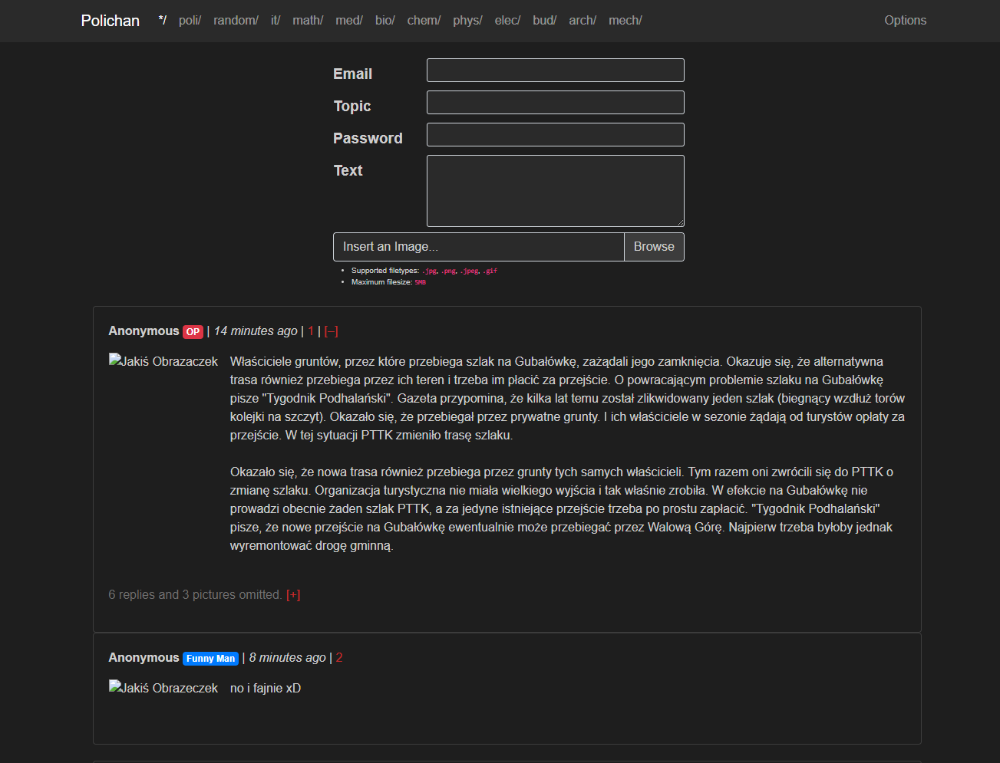

# Changelog

All notable changes to this project will be documented in this file.

The format is based on [Keep a Changelog](https://keepachangelog.com/en/1.0.0/),
and this project adheres to [Semantic Versioning](https://semver.org/spec/v2.0.0.html).

## [[0.9.0]] - 2021-06-20

### Added

- Backend model
- Backend REST Controller
- Backend limit and offset
- Backend endpoints
- Database

## [[0.8.3]] - 2021-06-15

### Added

- Now the frontend side of the project is tested via CI pipeline.

## [[0.8.2]] - 2021-05-30

### Fixed

- Navigation and View Fixes

## [[0.8.1]] - 2021-05-30

### Added

- Styled `href` shadows on hover
- Styled _Load More_ element
- Customised Scrollbar
- Added very subtle border for posts
- Now `Polichan` in navbar navigates to the main page
- `README.md` documentation

### Tweaked

- Now ID of Threads have golden colour to distinguish them from Post IDs
- Bottom margin of the board name title
- `README.md` and `CHANGELOG.md` formatting

### Fixed

- Now `ImageFullView` will not catch mouse input in the huge box area around it
- Now file input changes inner text to the path of selected file for upload.
- Now thread image after entering a thread can be enlarged


## [[0.8.0]] - 2021-05-28

### Added

- Scroll Image View as a component
- Styling for Submit Button

### Fixed

- Error:
  ```java
  client:135 (...)\fesm2015\ngx-translate-messageformat-compiler.js depends on 'messageformat'. CommonJS or AMD dependencies can cause optimization bailouts.
  ```
- Added constraint to the maximum scroll-depth down for an image _(now: can't go below `scale(0.2)`)_

### Changed

- Adjusted colour contrast for muted text
- Matched the colour and adjusted font formatting for invalid message information in the field form

## [[0.7.1]] - 2021-05-28

### Tweaked

- Constraints for reply fields

## [[0.7.0]] - 2021-05-28

### Added

- Error Handling
  - Error Modal View
  - Error Displays

## [[0.6.0]] - 2021-05-23

### Added

- Image Features:
  - Image can now be enlarged into full view from the preview.
  - Full Image View is draggable
  - Full Image View is resizable via scroll wheel
  - Image can be closed with `X` in the top right corner.


## [[0.5.0]] - 2021-05-16

### Added

- Feature: Internationalization - Configuration & propagation
- Feature: Own implementation of `InMemoryApi` for development and tests
- Feature: `InMemoryApi` now handle POST requests
- Feature: New routes: main, random, posts and for categories with categoryId resolver
- Feature: Added view logic for Navbar
- Feature: Pagination of Threads
- Feature: Main, Random, Category components
- Feature: Board component view logic implementation
- Feature: Initialized ReactiveForms in project
- Feature: Separate component for thread details initialized

## [[0.4.0]] - 2021-05-09

### Added

- Feature: Toggle visibility of a Thread on main page via `[-]` button.
- Feature: Displaying only last three posts linked to a given thread and `[+]` expanding button that shows all posts after clicking.
- Styling: Adjusted styling for posts in a thread on main page
- List of title headings corresponding to a given board & title placement under the navbar with the purpose of informing user on which board he currently is

### In-Progress

- Feature: Label Generator _(still needs some work)_

### Changed

- Styling: Default post border colour matching the background colour (so it's not visible)

### Planned

- Added example content printing after minimising a thread.
- To-do's for `post-information` in `/mainpage-thread/` component HTML file:
  - Link variable with number of posts in a thread that are omitted
  - Link variable with number of posts with pictures in thread that are omitted
  - Decide whether loading & hiding (current implementation) or load on demand _(on click)_ should be implemented on toggleShowPostsInThread button.

### Miscellaneous

- Tagged Version [0.3.0] and [0.2.0].


## [[0.3.0]] - 2021-05-04

## [[0.2.0]] - 2021-05-03

## [[0.1.0]] - 2021-05-01

### Added

- This [`CHANGELOG.md`](./CHANGELOG.md) file.
- Created navigation bar and inserted it into `Header` component
  - _(`/navbar/` component)_
- Created example user post
  - _(`/post/` component)_
- Created **New Thread** & **Main Reply** **Forms**; this component should work well for both with final action defined by the current board/thread that user is in
  - _(`/reply/` component)_
- Dark/Gray colour scheme that will be used in the project
- All the components can be viewed individually under their respective `href` names
- Inserted the components to homepage view. They will be more or less look somewhat like that at the end



### Fixed

- Linter Warnings
  - Double quotes changed to single quote in strings
  - Removed unused imports
  - Missed one semicolon

## [[0.0.2]] - 2021-04-27

### Added

- Bootstrap was added to the project
- The project structure on the frontend side has been created

## [[0.0.1]] - 2021-04-23

### Project Initialization.

### Added

- `README.md`

[0.9.0]: https://github.com/Luzkan/Polichan/releases/tag/v0.9.0
[0.8.3]: https://github.com/Luzkan/Polichan/releases/tag/v0.8.3
[0.8.2]: https://github.com/Luzkan/Polichan/releases/tag/v0.8.2
[0.8.1]: https://github.com/Luzkan/Polichan/releases/tag/v0.8.1
[0.8.0]: https://github.com/Luzkan/Polichan/releases/tag/v0.8.0
[0.7.1]: https://github.com/Luzkan/Polichan/releases/tag/v0.7.1
[0.7.0]: https://github.com/Luzkan/Polichan/releases/tag/v0.7.0
[0.6.0]: https://github.com/Luzkan/Polichan/releases/tag/v0.6.0
[0.5.0]: https://github.com/Luzkan/Polichan/releases/tag/v0.5.0
[0.4.0]: https://github.com/Luzkan/Polichan/releases/tag/v0.4.0
[0.3.0]: https://github.com/Luzkan/Polichan/releases/tag/v0.3.0
[0.2.0]: https://github.com/Luzkan/Polichan/releases/tag/v0.2.0
[0.1.0]: https://github.com/Luzkan/Polichan/releases/tag/v0.1.0
[0.0.2]: https://github.com/Luzkan/Polichan/releases/tag/v0.0.2
[0.0.1]: https://github.com/Luzkan/Polichan/releases/tag/v0.0.1
